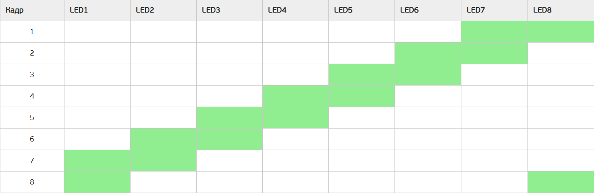

# se4-embeddedSystems-lab1
* В случае установки на SW переключателях кода N (см. вариант задания) на светодиодные индикаторы LED1 … LED8 должна выводиться анимация согласно варианту задания. Во всех остальных случаях светодиодные индикаторы отражают значение, выставленное на SW переключателях.

* По кнопке nBTN процессорного модуля должна осуществляться приостановка анимации. Одно нажатие – анимация приостанавливается, следующее нажатие – анимация продолжается с того же момента. Когда анимация не выводится на светодиоды, нажатие на кнопку игнорируется.

* Зеленым отмечено состояние, когда соответствующий светодиод горит. В противном случае – не горит, то есть выключен.

* Анимация выводится циклически, то есть после вывода последнего кадра анимации она начинается сначала – с первого кадра. Время показа одного кадра – 0.5 с.

*N = 0x8 (шестнадцатеричное значение)*

Состояния светодиодов процессорного модуля в процессе работы программы:

| Условие |	Светодиод VD6 |	Светодиод VD7 |
| ------- | ------------- | ------------- |
| Вывод анимации на линейку светодиодов модуля расширения |	Горит зеленым	| Не горит |
| Остановка анимации по кнопке nBTN	| Не горит | Горит красным |
| Режим вывода состояний SW переключателей | Не горит |	Горит желтым |

